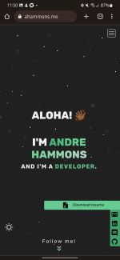
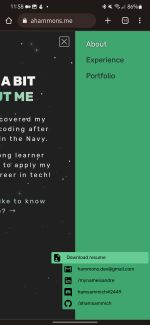

# Andre's Dev Portfolio

The second version of my personal website. This project was built with Astro and Vue.js and is hosted on Firebase.

NOW LIVE! Check it out at [**ahammons.me**](https://ahammons.me)!

## Features

### ***Sidebar menu*** pushes (rather than overlay) the screen from the right to reveal navigation and social links.

- I saw something similar on [a software engineer's website](https://www.hellomayuko.com) and was inspired to attempt a recreation.

- I made the animated hamburger menu after watching [a video by a favorite CSS Youtuber](https://www.youtube.com/watch?v=R00QiudbD4Y&t=1176s&ab_channel=KevinPowell).

 

### ***Dark and light modes*** available with on-screen animated toggle.

- I created a pseudo-starfield background for the dark theme. Inspiration was taken from [this ***awesome portfolio***](https://soumyajit.vercel.app/) found [here on GitHub!](https://github.com/soumyajit4419/Portfolio)

### ***Animated timeline*** reveals itself on scrolling down.

- This took some trial and error while learning about Intersection Observer.
- [***Click here*** to see the timeline and dark mode.](https://twitter.com/hammons_dev/status/1620014264001122311?ref_src=twsrc%5Etfw%7Ctwcamp%5Etweetembed%7Ctwterm%5E1620014264001122311%7Ctwgr%5E9ddff92e03f797b6a91e5d2479a6d1e1bcd1198e%7Ctwcon%5Es1_c10&ref_url=https%3A%2F%2Fpublish.twitter.com%2F%3Fquery%3Dhttps3A2F2Ftwitter.com2Fhammons_dev2Fstatus2F1620014264001122311widget%3DTweet)

## What I've learned

I discovered that ***Iconify*** offers an extensive icon library through the astro-icon integration! No need to scour the web for icons (which is exactly what I had been doing for a very long time). :weary:

- [This video about Iconify](https://youtu.be/a6XI8XAuORM) popped up in my feed an hour after I finished. 

Mobile viewports can make responsive web design a nightmare. Choosing the right CSS units ('vw' vs. 'svw' vs. 'dvw', etc.) can be frustrating when, despite your best effort, elements either overflow or come up short. :confounded:

- I reference [this video by another favorite web dev Youtuber](https://youtu.be/5m6JOJLy5B0) often to refresh how the units work.

## Feel free to fork!

Hopefully this may provide you some help if you're looking to create/update your own web portfolio, whether you take this as a template or just as inspiration for your own design! :thumbsup:

If you [clone this repo](https://github.com/AhamSammich/dev-portfolio), just give it a :star: and feel free to share your thoughts on how to make it better!

Thank you for reading! :grin: :wave:

## [Connect With Me](https://ahammons.me/#connect)
:email: hammons.dev@gmail.com
:speech_balloon: @hammons_dev
